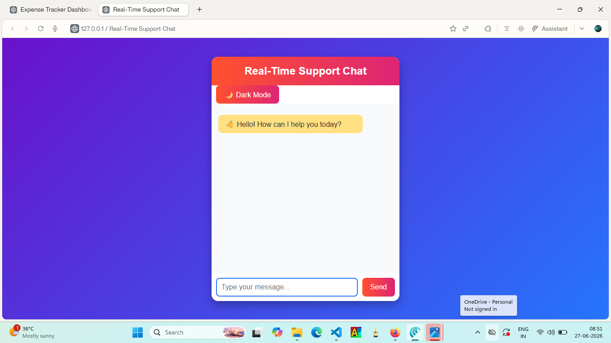

# 💬 Real-Time Support Chat

A modern web-based Real-Time Support Chat application built using HTML, CSS, and JavaScript. It provides an interactive chat interface with automated responses, dark mode support, smooth animations, and a clean user-friendly design.

---

## ✨ Features

- 💬 Interactive chat interface
- 🤖 Automated chatbot replies
- 🌙 Dark Mode toggle
- 🎨 Modern responsive UI
- ⚡ Smooth message animations
- 📱 Mobile-friendly layout
- 🧹 Clear chat functionality
- 🚀 Fast and lightweight

---

## 🛠️ Technologies Used

- HTML5
- CSS3
- JavaScript (ES6)

---

## 📂 Project Structure

```
Real-Time-Support-Chat/
│── index.html
│── style.css
│── script.js
│── output.png
│── README.md
```

---

## 🚀 How to Run

1. Download or clone the project.
2. Open the project folder.
3. Run `index.html` using Live Server or any web browser.
4. Start chatting with the support bot.

---

## 📸 Output

Add the screenshot below:



---

## 📌 Future Enhancements

- AI-powered chatbot integration
- User authentication
- File sharing support
- Voice messaging
- Real-time backend using Firebase or Node.js

---

## 👩‍💻 Developed By

**Miruthula Sri**

Internship Project
